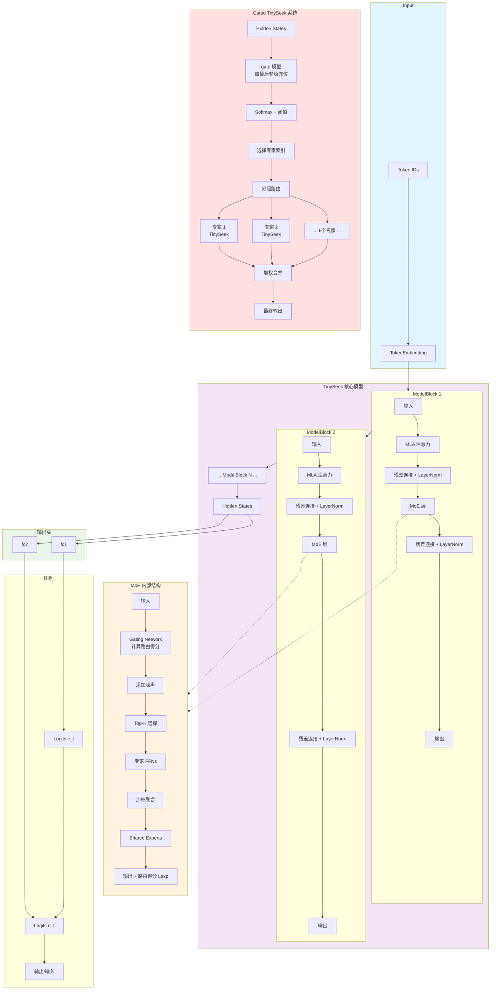

# 小寻（tinyseek） — 学生探索记录（MoE + Gate）

 


---

## 项目简介

本项目是作者在学生阶段完成的探索性实现，旨在快速验证混合专家模型（Mixture-of-Experts, MoE）与样本级门控（gate）机制，同时探索 LoRA / Prefix 等参数高效微调方法。代码以实验和教学为主要目的，未经过工业级稳定性或安全审查。

### 核心特性

- 轻量级 MoE 层与 MLA 注意力机制
- 双路输出头（主预测/候选预测），支持差异化训练与采样策略
- 完整的微调支持：LoRA / Prefix，以及 gate 合并导出流程
- 适合小规模硬件的训练优化（梯度累积、混合精度）

---

## 效果演示


*图：tinyseek 对话演示*

## 目录

- [快速上手](#快速上手)
- [设计要点](#设计要点)
- [训练细节](#训练细节)
- [微调方法](#微调方法)
- [门控机制](#门控机制)
- [实验记录](#实验记录)
- [常见问题](#常见问题)
- [贡献与许可](#贡献与许可)

---

## 快速上手

### 环境配置

```powershell
conda create -n tinyseek python=3.10 -y
conda activate tinyseek
python -m pip install -r requirements.txt
```

### 运行示例

```powershell
# 快速评估（默认CPU）
python evaluate.py

# 对话模式（默认CPU）
python agent_chat.py

# 交互式训练选择
python run.py
```

---

## 设计要点

### 数据流概览

```
text → Vocab.encode → Gate_model → TinySeek_model → logits
```

### 核心模块 ModelBlock（伪代码）

```python
def ModelBlock(x):
    y = MLA(x)                          # 多头潜在注意力
    x = LayerNorm(x + y)                 # 残差连接 + 层归一化
    
    out, routing_score = MoE(x)          # MoE层：输出与路由得分
    x = LayerNorm(x + out)                # 残差连接 + 层归一化
    
    return x, routing_score               # 返回输出与路由得分用于正则
```

### MoE 实现细节

- **专家选择**：gate logits 添加噪声 → softmax → top-k 选择
- **共享专家**：支持 shared_experts 机制
- **返回值**：(output, routing_score)，后者用于训练时的正则项

### 双路预测机制

- `fc1`：主预测头
- `fc2`：候选预测头
- 训练时：两路交叉熵损失求和
- 生成时：结合两路概率与重复惩罚采样

---

## 训练细节

### 损失函数

```
Loss = CE(主预测) + CE(候选预测) + α * Lexp
```

其中 Lexp 是基于 routing_score 的正则项

### 优化配置

| 配置项 | 说明 |
|--------|------|
| 优化器 | Adam，默认学习率 5e-4 |
| 混合精度 | CUDA 环境下自动启用 torch.amp + GradScaler |
| 梯度累积 | 通过 accumulation_steps 支持小显存训练 |
| 梯度裁剪 | 建议设置 max_norm=1.0 |
| 学习率策略 | warmup 线性预热 / 指数衰减 |

### 检查点命名规范（预训练示例）

- 中间检查点：`out/TinySeek_Pre{index}_{epoch}.pkl`
- 最终检查点：`out/TinySeek_Pre_final.pkl`

---

## 微调方法

### SFT（监督微调）

- **数据格式**：拼接为 User: ... / Assistant: ...<|im_end|>
- **Mask机制**：通过 mask id 屏蔽 label 中的特定区间
- **检查点**：`TinySeek_SFT{index}_{epoch}.pkl` / `TinySeek_SFT_final.pkl`

### LoRA（低秩适配）

- **应用方式**：`model.lora_model.apply_lora(model, rank, scale)`
- **参数冻结**：训练前冻结非 LoRA 参数
- **权重保存**：需保留 rank/scale 元数据
- **检查点**：`TinySeek_Lora{index}_{epoch}.pkl` / `TinySeek_Lora_final.pkl`

### Prefix（前缀微调）

- **应用方式**：`model.prefix_model.apply_prefix(model, scale)`
- **参数冻结**：仅解冻 prefix 参数（如 prefix_1/prefix_2）
- **检查点**：`TinySeek_Prefix{index}_{epoch}.pkl` / `TinySeek_Prefix_final.pkl`

---

## 门控机制

### Gate 预测

- 使用序列最后一个 'User'位置 的输出
- 预测专家分配（默认输出维度 6）

### Gate 监督训练

```python
# cacu_gate_loss 核心流程
1. 对每个样本，在各专家上计算无梯度的 per-sample loss
2. 选择最小 loss 对应的专家 index 作为监督目标
3. 计算 gate 的交叉熵损失
```

### 专家合并

`gated_TinySeek.load_part_model` 在加载多个专家时会：

- 尝试兼容 LoRA 权重
- 平均专家的 tokenEmbedding 以保证输入编码一致性

---

## 数据集
1.本项目使用了来自 ModelScope 的数据集 [**gongjy/minimind_dataset**]，在此向其作者表示感谢。
2.除此之外，作者通过调用DeepSeek的API，生成了5000余条梳理购物清单的对话数据，用于验证模型在特定任务上的表现。原始数据见Dataset/。
3.训练gated_TinySeek时，作者从ModelScope 的数据集 [**gongjy/minimind_dataset**]以及我的购物清单数据集上随机抽取11268条对话数据再次打乱。

### 数据集信息

-   **名称**：gongjy/minimind_dataset
-   **来源链接**：https://www.modelscope.cn/datasets/gongjy/minimind_dataset/files
-   **许可证**：Apache License 2.0

### 遵守原始许可证

本数据集的使用遵循 Apache License 2.0 的规定。
根据许可证要求，我们在此声明：

1.  我们保留了原始数据集中包含的所有版权、专利、商标及归属声明。
2.  我们删除了原始数据集中rmix相关的有过多英文的部分，以符合中文语境。详情可见[](tools\utilities_c\norm_mix_r.c)
3.  我们将原始数据集中identity相关的部分进行了修改，修正了作者名和模型名，以避免混淆。
4.  本项目的根目录下附有 Apache License 2.0 的完整副本。

完整的许可证条款请参阅项目根目录下的 [LICENSE](./LICENSE) 文件，或访问：http://www.apache.org/licenses/LICENSE-2.0。

---

## docs要点速览

为避免在 README 中重复大量实现细节，我将技术文档拆分至`docs/`下。下列为从 `docs/` 中摘录的核心要点，便于快速浏览：

- [architecture.md](docs/architecture.md)

  - TinySeek = TokenEmbedding → 多层 ModelBlock(MLA + MoE) → 双路输出(`fc1`/`fc2`)。

  - `MoE.forward` 返回 `(output, routing_score)`，`routing_score`（Lexp）被训练器作为正则项使用。
  
  - `gated_TinySeek` 封装多个专家 + 一小型 gate，用于样本级专家分配与合并；合并时会平均专家的 `tokenEmbedding`。
  - 结构简图：


  
- [training.md](docs/training.md)
  
  - 训练 wrapper（`train_agent/*_train.py`）加载 `model_config.json` 并调用对应训练器；训练器支持混合精度、梯度累积与两类 LR 策略（warmup / 指数衰减）。
  
  - 日志写入 `log.txt` 与 `logs/`，建议在开始新实验前清理旧日志以便对比。

- [pretraining.md](docs/pretraining.md)
  
  - 预训练损失 = CE(c_t) + CE(n_t) + alpha * Lexp，检查点命名为 `out/TinySeek_Pre{index}_{epoch}.pkl`，最终 `TinySeek_Pre_final.pkl`。

  - 数据按 JSONL 行读取并以 `<|im_end|>` 切分对话单元，缺失 `vocab.json` 时会基于语料生成。

- [sft.md](docs/sft.md)

  - SFT wrapper 使用特定 prompt 拼接策略，将对话转为模型输入；mask id 用于屏蔽 label 中的 `[MASK]` 区间。

  - 检查点命名以 `TinySeek_SFT*` 为前缀，训练器会按 `last_index` 决定从哪个 checkpoint 恢复。

- [lora.md](docs/lora.md)

  - `apply_lora` 在模型上插入低秩适配层，训练前会冻结非 LoRA 参数，仅解冻包含 `lora` 的模块。

  - LoRA 权重通常为部分 state_dict，加载时需保留 rank/scale 元信息以便兼容。

- [prefix.md](docs/prefix.md)

  - `apply_prefix` 插入可学习前缀向量并只解冻 prefix 参数（如 `prefix_1`/`prefix_2`），scale 控制前缀强度。

- [gating.md](docs/gating.md)

  - Gate 训练使用 `cacu_gate_loss`：为每个样本在各专家上计算无梯度的 per-sample loss，选最小损失对应专家作为监督信号来训练 gate。

  - `gated_TinySeek.load_part_model` 在合并专家时会尝试兼容 LoRA 权重并平均专家 embedding。

- [experiments.md](docs/experiments.md)

  - 摘录了实验训练细节和损失下降的折线图，以表格记录实验数据，便于后续分析与对比。
  - 表图群览：/collage_all_48_12x4.png)

---

## 常见问题

### Q: 无法加载权重？

A: 检查权重类型：

- 完整权重：直接加载
- LoRA 权重：需先 apply_lora
- Prefix 权重：需先 apply_prefix

### Q: MoE 路由不稳定？

A: 尝试：

- 减小 gate 噪声
- 增加 warmup 步数
- 调整 other_experts 参数

---

## 关键源码定位

| 功能 | 路径 |
|------|------|
| 模型定义 | [model/tiny_seek.py](model/tiny_seek.py) |
| MoE 实现 | [modules/moe.py](modules/moe.py) |
| 预训练 | [train_agent/trainers/pre_training.py](train_agent/trainers/pre_training.py) |
| SFT | [train_agent/trainers/sft_training.py](train_agent/trainers/sft_training.py) |
| LoRA | [train_agent/trainers/lora_tuning.py](train_agent/trainers/lora_tuning.py) |
| Prefix | [train_agent/trainers/symprefix_tuning.py](train_agent/trainers/symprefix_tuning.py) |
| 门控训练 | [train_agent/trainers/gated_training.py](train_agent/trainers/gated_training.py) |

*温馨提示：仓库架构以总结到 [repo_structure.md](repo_structure.md)文件*

---

## 贡献与许可

### 贡献指南

- 欢迎提交 Issue
- 若修改训练/保存逻辑，请同步更新 docs/*.md 

### 许可证

本项目采用 Apache License 2.0 许可证。

完整的许可证条款请参阅项目根目录下的 [LICENSE](./LICENSE) 文件，或访问：http://www.apache.org/licenses/LICENSE-2.0

---

作者：浙江大学学生 绿意不息
